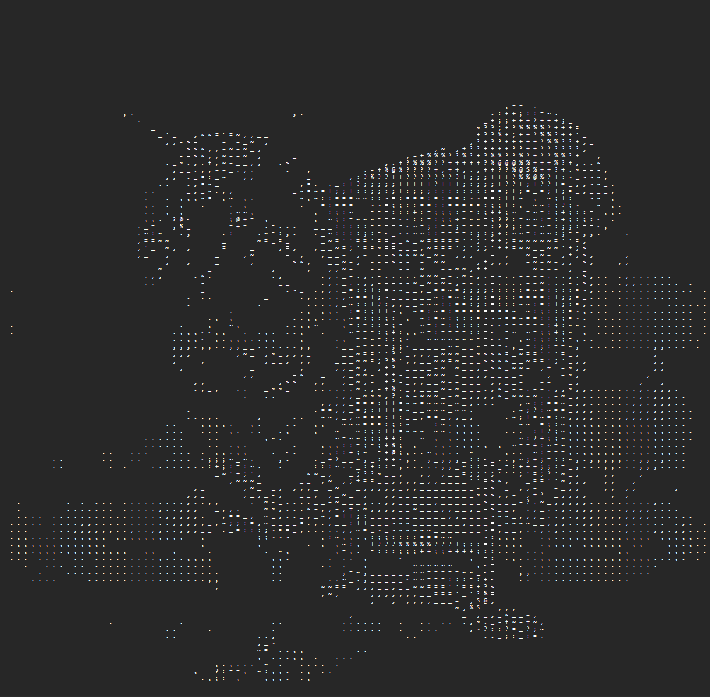

# Ascii Maker App

This is the contination of the [PNG-to-Plain-Ascii](https://github.com/Blockitifluy/PNG-to-Plain-Ascii) repository. The major difference is that this repo is a website with a server and latter is writen witth python.

## How to Build

Run the build.bat on the root directory, to compile both the server and the client.

```bat
./build
```

and

```bat
npm run build
```

You can see changes on [dist](dist/) and `bin/Debug/net{VERSION HERE}`.

## Client

The client is made with:

- Vite,
- SolidJS,
- TypeScript

### `npm run dev`

Runs the app in the development mode.<br>
Open [http://localhost:5173](http://localhost:5173) to view it in the browser.

## Usage

```bash
npm install # or pnpm install or yarn install
```

## Example

| Orginal Image           | Ascii File                        |
| ----------------------- | --------------------------------- |
|  |  |

## Deployment

Learn more about deploying your application with the [documentations](https://vite.dev/guide/static-deploy.html)
